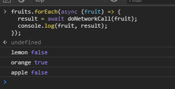

# Programação no estilo funcional em Javascript, Promises e dores de cabeça
Quem desenvolve em javascript já deve ter se deparado com algumas funções de operações sobre objetos iteráveis (`forEach`, `map`, `reduce`):

```javascript
const list = ['apple', 'banana', 'watermelon'];

// forEach
list.forEach((item) => {
    console.log('Item:', item);
});

// map
const changedList = list.map((item) => item + 1);

// reduce
const itemSum = list.reduce((accumulated, item) => {
    return accumulated + item;
}, 0);
```

Esses caras já estão aí há algum tempo e são uma forma funcional de realizar operações sobre esse tipo de objetos.

Um dos conceitos na programação funcional é que você escreve seu código de maneira mais descritiva, se preocupando em dizer **o que acontece**, não **como acontece**.

Comparar o `.forEach` com um `for (;;)` ("for raiz") é um bom exemplo pois no `forEach` você não se preocupa em controlar os passos da iteração sobre o objeto, seu foco é direcionada para o que deve acontecer para cada item durante a iteLração. Já em um "for raiz", além de se preocupar com o que deve acontecer com o item em questão, você precisa se preocupar com como os itens são recuperados, como conseguir o próximo item e quantas vezes o laço será executado.

Desde o ES6 temos a possibilidade de trabalhar com código assíncrono no javascript sem ter que passar aquele zilhão de callbacks (a.k.a. callback hell). As maravilhas tecnológicas por trás disso são as [Promises](https://developer.mozilla.org/pt-BR/docs/Web/JavaScript/Reference/Global_Objects/Promise).

Com a chegada do ES8 para facilitar a vida dos desenvolvedores, que são criaturas insatisfeitas por natureza, foi lançada a especificação de funções [async/await](https://developer.mozilla.org/pt-BR/docs/Web/JavaScript/Reference/Operators/await) - mais conteúdo [aqui](https://developer.mozilla.org/en-US/docs/Learn/JavaScript/Asynchronous/Async_await).

Em algum momento você pode se deparar com uma situação em que tenha uma lista e precisa realizar alguma operação assíncrona com os itens dessa lista, na ordem em que eles aparecem na lista. Provavelmente você pode brotar com uma solução parecida com essa:

```javascript
const fruits = ['apple', 'lemon', 'orange'];

fruits.forEach(async (fruit) => {
    const result = await doNetworkCall(fruit);
    doSomethingElseSynchronously(fruit, result);
});
```

Conhecendo o funcionamento do `async/await` é esperado que o código acima funcione, porém, ele não terá o comportamento esperado:



Isso acontece porque tanto o `forEach` quanto seus companheiros `map` e `reduce` por serem mais antigos que a especificação da `Promise` e `async/await` simplesmente não são compatíveis com essas features.

Para exemplificar melhor, uma versão **muito** simplificada do `forEach` seria: 

```javascript
Array.prototype.forEach = function (callback) {
  for (let i = 0; i < this.length; i++) {
    callback(this[i], i, this);
  }
};
```

Como você pode notar, `callback` não está sendo aguardado (`await`) dentro do `forEach`, logo, a cadeia de `Promises` é quebrada, resultando no comportamento inesperado.

## Solução
A solução é não usar esses métodos quando trabalhar com operações assíncronas. Usar o bom e velho "for raiz" garantirá que o resultado será o esperado.

```javascript
async doAsyncProcess(fruits) {
    for (let i=0; i < fruits.lenth; i++) {
        const fruit = fruits[i];

        const result = await doNetworkCall(fruit);
        doSomethingElseSynchronously(fruit, result);
    }
}
```

## Ressalvas
O textão acima exemplifica casos onde você precisa garantir que as operações sejam realizadas na ordem em que aparecem no objeto iterável. Caso seja possível fazer as operações em paralelo, você pode usar do combo `await Promise.all` + `Array.map` para realizar as operações:

```javascript
async doAsyncProcess(fruits) {
    await Promise.all(fruits.map(async (fruit) => {
        const result = await doNetworkCall(fruit);
        doSomethingElseSynchronously(fruit, result);
    }));

    doMoreSynchronousStuff();
}
```
:warning: **Nota**  
Nesse exemplo, `Promise.all` está sendo utilizado apenas para aguardar a resolução de todas as promises que são implicitamente criadas com o método `.map` antes de continuar com execução da função `doMoreSynchronousStuff`. Sabemos que `.map` cria promises pois a função que é aplicada durante a iteração está marcada como `async`, logo seu retorno sempre é uma `Promise`.

Caso o restante do código dependesse dos valores resolvidos das promises, alguns ajustes seriam necessários no código, na função aplicada durante o `map` e nos valores aguardados de `Promise.all`.

## Bônus
Código de exemplos está disponível no codepen:  
[https://codepen.io/mesaquen/pen/JgXxZL?editors=1111](https://codepen.io/mesaquen/pen/JgXxZL?editors=1111)
