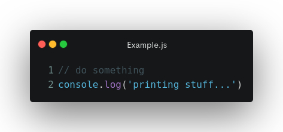

# Dica rápida: Maneiras de apresentar seu código

Utilizando redes sociais, você já deve ter se deparado com algumas imagens contendo código fonte, que parecem familiares, possuem formatação de sintáxe mas, não são screenshots de nenhum editor de código que você conheça.

Existem algumas ferramentas onde você pode gerar essas imagens de maneira simples e rápida.

1. [carbon.now.sh](https://carbon.now.sh/)
1. [codeimg.io](https://codeimg.io/)
1. [Rust playground](https://play.rust-lang.org/)
1. [Silicon](https://github.com/Aloxaf/silicon) (CLI)
1. [Polacode](https://github.com/octref/polacode) (Extenção VSCode)

Agora você já sabe. É só escolher uma das ferramentas e sair compartilhando seu código de uma maneira mais chamativa.
